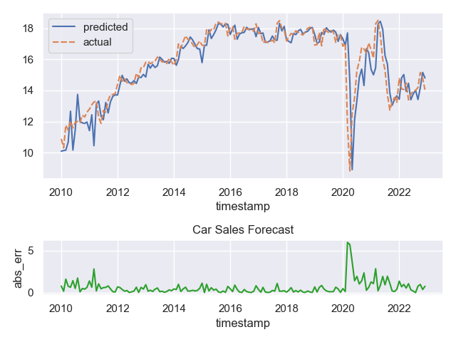

# Rolling Car Sales Forecasting

In this example, we create an XGBoost model that forecasts the total monthly vehicle sales in the USA.
We use Federal Reserve Economic Data [(FRED)](https://fred.stlouisfed.org/) for our data, and
re-train our model at the end of each month. Lastly, we backtest the model
and visualize its predictions and rolling error from 2010 to the present day.

---
## Source

We use FRED's API to fetch historic federal funds rate, unemployment rate, CPI, and vehicle sales data. 
You can obtain an API key by signing up for a free account
on the [FRED website](https://fred.stlouisfed.org/). Then, we combine this data into a single `OracleDataFrame`
to fetch historical data on-the-fly during the backtest.

=== "Step 1"
    Define a function to fetch and prepare FRED data for a given `series_id`.

    ```python linenums="1" hl_lines="9-19"
    --8<-- "./tutorial_scripts/sales.py:source"
    ```

=== "Step 2"
    Combine the data into a single `OracleDataFrame`.

    ```python linenums="1" hl_lines="7 21-25"
    --8<-- "./tutorial_scripts/sales.py:source"
    ```

--- 
## Warp

First, we declare our XGBoost model and initial variables. Then, we define a function to train the model with the latest data and log the model's performance, predictions and actual targets.
Lastly, using anterior's `BackTester`, we schedule the training function to run every month and backtest the model's
predictions and rolling error from 2010 to the present day.

=== "Step 1"
    Declare the XGBoost model and initial variables.

    ```python linenums="1" hl_lines="6-7"
    --8<-- "./tutorial_scripts/sales.py:warp"
    ```


=== "Step 2"
    Define the training function with performance logging.

    ```python linenums="1" hl_lines="12-20"
    --8<-- "./tutorial_scripts/sales.py:warp"
    ```

=== "Step 3"
    Schedule the training function and backtest the pipeline.

    ```python linenums="1" hl_lines="9 11 23"
    --8<-- "./tutorial_scripts/sales.py:warp"
    ```
---

## Push

We visualize the model's rolling predictions vs actual targets, and the rolling absolute error using seaborn and plotly.

```python linenums="1" 
--8<-- "./tutorial_scripts/sales.py:push"
```

<figure markdown="span">
  
</figure>